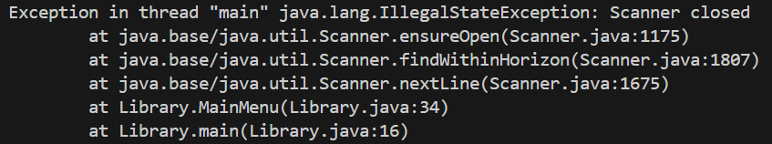
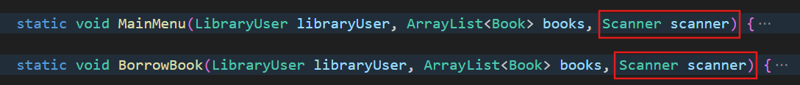
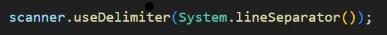

# Challenges Encountered

## Scanners inside methods error

How I solved it: I put one scanner in the main method and passed it as a parameter inside the methods that require user input

## Scanners sometimes returns empty variable

How I solved it:

